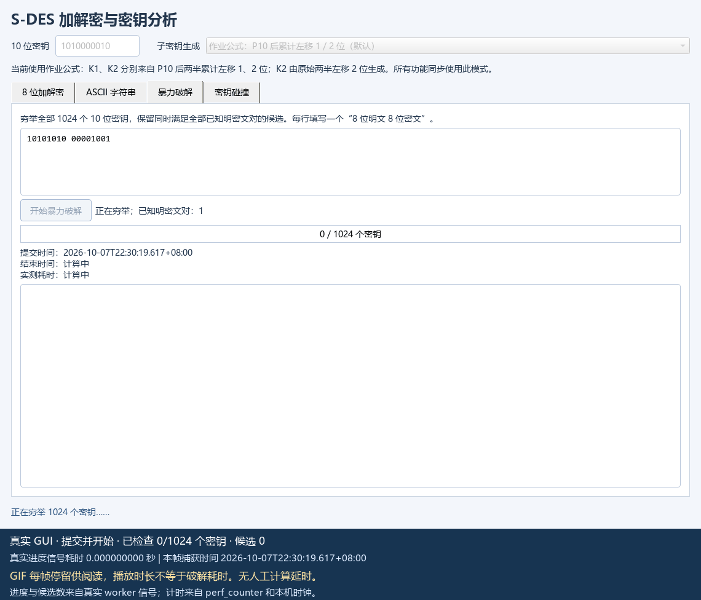

# 信息安全导论 · 实验一：S-DES

目标公开仓库：[rickgao3420-dev/information-security-exp1](https://github.com/rickgao3420-dev/information-security-exp1)。

依据[石墨作业要求](https://shimo.im/docs/m5kvdlMaKvcENy3X)，使用 Python 实现 S-DES、PyQt5 图形界面、ASCII 字符串加解密、已知明密文穷举与密钥碰撞分析。算法核心逐项实现置换、循环移位、异或、S 盒与 Feistel 轮函数，没有调用现成密码库。

## 提交材料

| 作业条目 | 材料 |
| --- | --- |
| 5.2.1 源代码 | [sdes.py](sdes.py)、[analysis_tools.py](analysis_tools.py)、[gui.py](gui.py)、[cli.py](cli.py)、[独立参考实现](reference_sdes.py)、[测试](tests/)、[证据与交换脚本](scripts/) |
| 5.2.2 测试结果 | [五关测试报告](docs/test_report.md)、[机器汇总](results/summary.json)、[截图及 GIF](artifacts/gui/) |
| 5.2.3 相关文档 | [用户指南](docs/user_guide.md)、[开发手册与接口文档](docs/developer_manual.md)、[要求与参数核对](docs/requirements.md) |

## 快速运行

要求 Python 3.10 或以上。在本文件所在目录执行：

```sh
python -m pip install -r requirements.txt
python gui.py
```

只用命令行或运行算法测试时，无需安装 GUI 依赖：

```sh
python cli.py bits encrypt 10011010 --key 1010000010
python cli.py bits decrypt 11101111 --key 1010000010
python -m unittest discover -s tests -v
```

默认模式的加密结果为 `11101111`，解密恢复 `10011010`；添加 `--trace` 可输出中间状态。详细输入方式见[用户指南](docs/user_guide.md)。

## 参数与密钥调度

使用作业给出的 S 盒，尤其是其修改过的 S-box2。作业公式 `K_i=P8(Shift^i(P10(K)))` 与课件先 LS1 再额外 LS2 的流程存在歧义，因此显式提供两种模式：

| 模式 | 从 P10 后两半块计算的总左移量 | 用途 |
| --- | --- | --- |
| `assignment`（默认） | 1、2 | 按作业公式字面解释 |
| `cumulative` | 1、3 | 兼容课件累计移位流程 |

所有加密、解密、穷举、碰撞和交换向量均标注模式；跨组测试前须同步模式和全部参数。[参数核对文档](docs/requirements.md)记录原公式、差异和处理依据。

## 实测结果与边界

- 29 项自动测试通过。对两种模式分别遍历 1024 密钥 × 256 分组，共 524,288 个输入；核对两份独立实现的加密结果及双向解密，并验证 2,048 个固定密钥下的映射均为双射。
- 26 项 GUI 检查通过，保留 10 张功能截图、35 帧破解 GIF 及带时间戳的捕获记录。
- 第 2 关已完成本机两份独立实现对照，并提供 128 条 JSON/CSV 交换向量。**尚未获得另一组程序，真实组间与异构平台测试尚未进行**，不能将本机对照称为已完成组间测试。
- 默认模式下，每个固定明文的 1024 个密钥可产生 254 种密文，最大碰撞桶含 8 个密钥；全部密钥只对应 512 种不同的完整加密映射。
- 例如 `1010000010` 与 `1110000010` 在默认模式下全局等价。计算实验从首对 `11010111 → 11101000` 开始，增加明密文对后候选数从 6 减到 2；更多明密文对也无法区分这一对等价钥。`cumulative` 模式下本实验最终筛到原密钥一个。下方 GUI 动图使用另一对 `10101010 → 00001001`，有 4 个候选。

以上是该参数与模式下的实际枚举结果，详见[五关报告](docs/test_report.md)，不推断其他 S-DES 参数也具有相同性质。

## 破解动图



本次 GUI 破解 1024 个密钥实测约 0.00434 秒。动图以真实窗口截图与进度信号生成，播放 12.7 秒以便阅读；播放时长不代表破解耗时。完整起止时间和逐帧记录见 [capture_manifest.json](artifacts/gui/capture_manifest.json)。

## 复现证据

```sh
python scripts/run_evidence.py
python scripts/capture_gui.py
python scripts/audit_submission.py
```

脚本会覆盖各自生成的结果及时间记录。提交的记录来自 Windows / Python 3.13.5 的真实运行；换一台机器，耗时与时间戳会变化。完整加密映射、源文件 SHA-256、逐明文碰撞 CSV、等价类和攻击结果位于 [results/](results/)。

S-DES 用于理解算法；本实验逐字节独立加密，不适用于保护真实敏感数据。课程原始 PPT/PDF 未被修改，也未包含在公开交付材料中。
