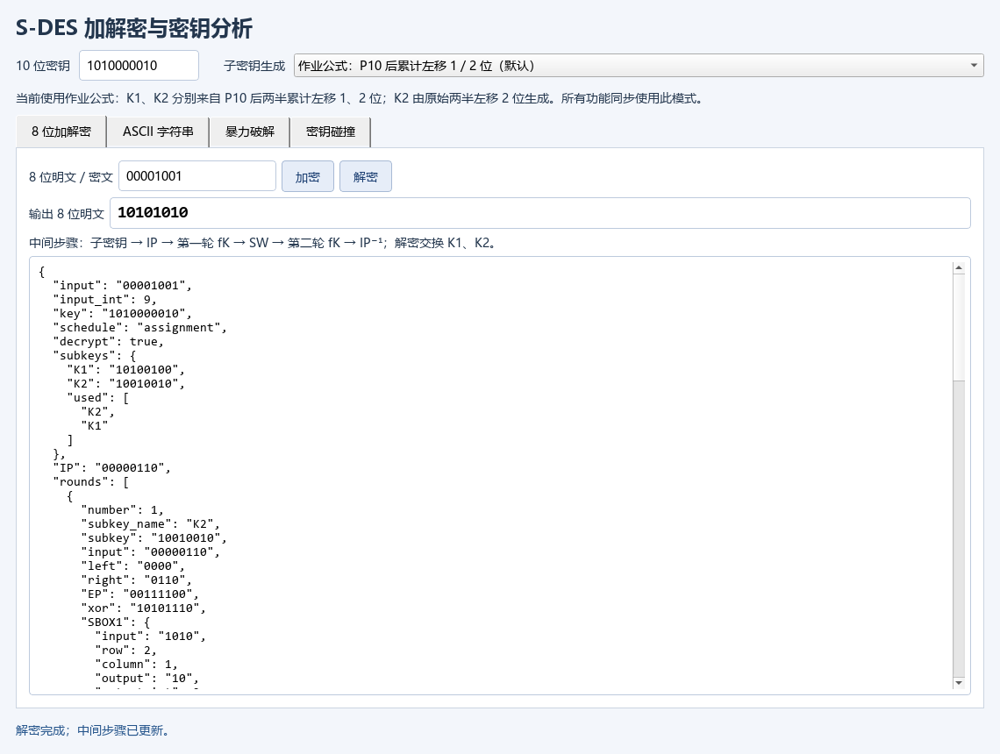
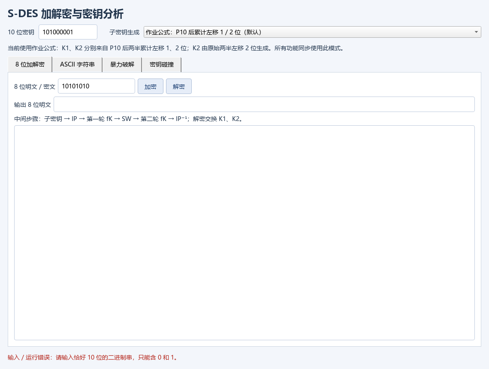
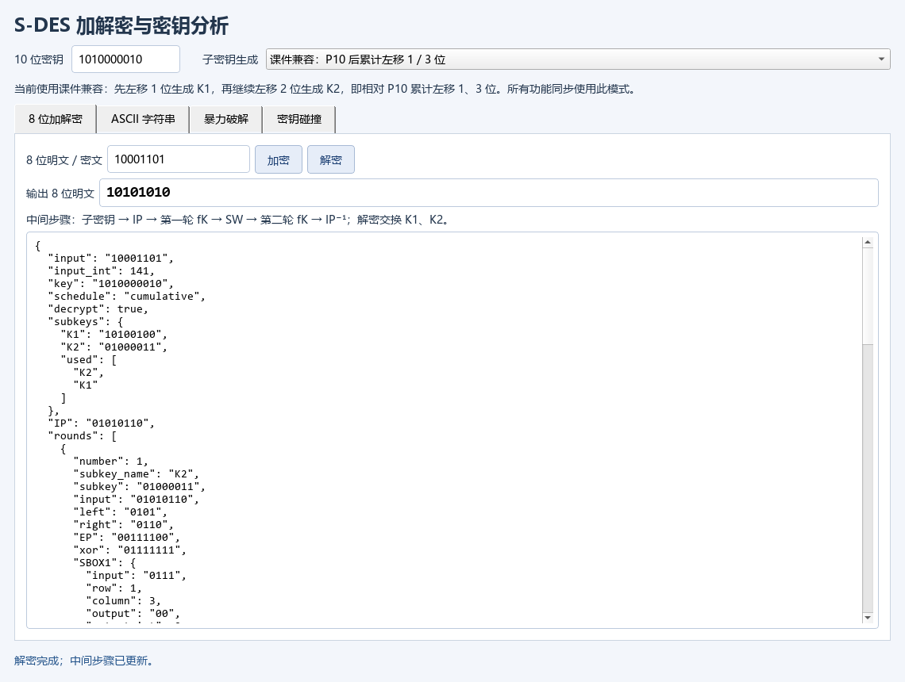
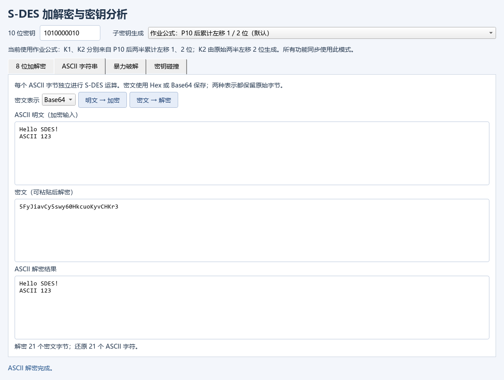
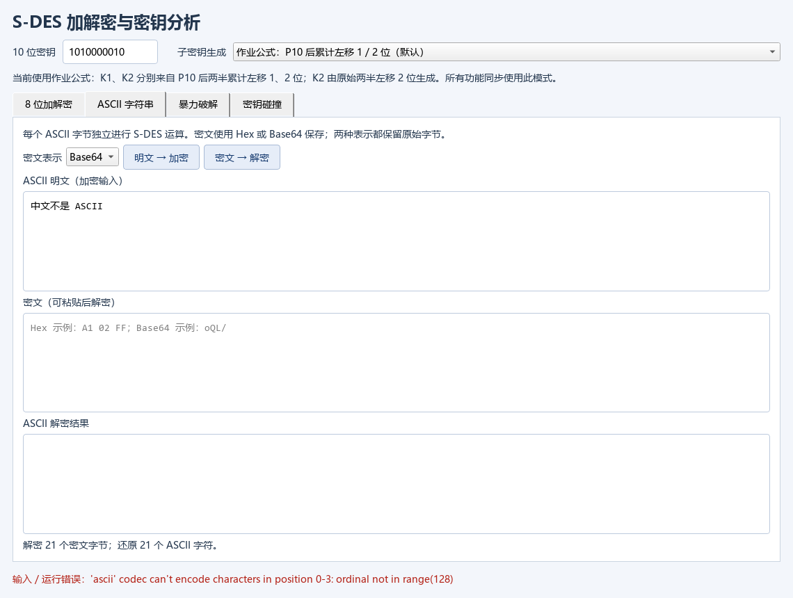
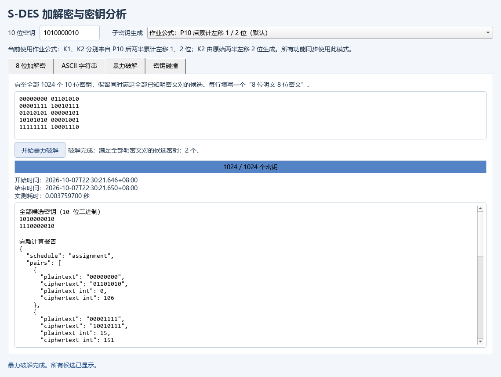
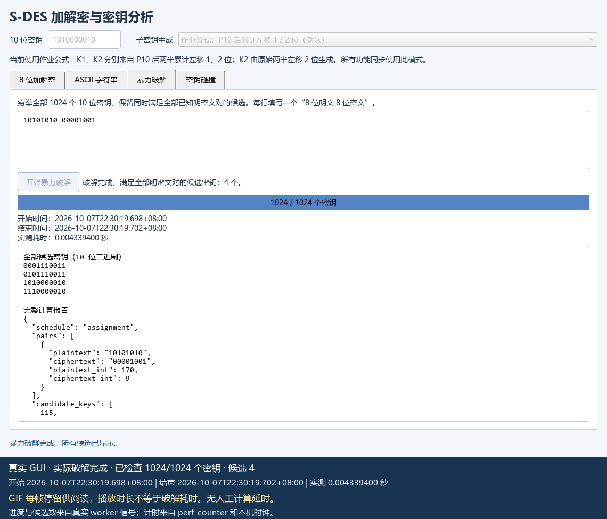

# 实验一：S-DES 测试报告

本报告记录已实际执行并保存的测试。默认结论采用作业公式调度 `assignment`；`cumulative` 是课件兼容调度，结果单独列出。整数实现与独立字符串实现的本机交叉验证通过；真实他组程序和异构平台验证尚未进行，因此第2关的实际组间互操作要求仍待补齐。

所有数值以 [最终计算汇总](../results/summary.json)、[单元测试记录](../results/unit_tests.json) 和 [GUI 捕获清单](../artifacts/gui/capture_manifest.json) 为依据。计算证据生成于 `2026-10-07T22:36:40.980+08:00` 至 `2026-10-07T22:36:58.733+08:00`，完整生成耗时 **17.753411 秒**；其中 **29项单元测试全部通过，耗时16.565432秒，失败0、错误0、跳过0**。这是补齐两个调度全域测试后的最终运行记录。

## 5.2.1 源代码索引

下列路径均相对 `exp1/`。各主要源码的 SHA-256、实际 Python 解释器及操作系统信息保存在 [summary.json](../results/summary.json) 的 `source_sha256` 和 `environment` 字段。

| 文件 | 职责 |
|---|---|
| [sdes.py](../sdes.py) | 整数位运算核心、两种密钥调度、8位分组与字节/ASCII加解密、输入校验、逐轮轨迹 |
| [reference_sdes.py](../reference_sdes.py) | 独立字符串参考实现；自行定义参数，使用字符索引、字符串异或和循环移位，不调用核心算法或辅助函数 |
| [analysis_tools.py](../analysis_tools.py) | 全部1024钥穷举、固定明文密文分桶、全部256明文扫描、完整置换等价密钥分析 |
| [gui.py](../gui.py) | 图形界面、位串/ASCII输入、Hex/Base64显示、后台穷举与碰撞分析、进度和计时 |
| [cli.py](../cli.py) | 命令行加解密与分析入口 |
| [tests/test_sdes.py](../tests/test_sdes.py) | 手算向量、输入校验、ASCII/字节测试、全部子密钥对照、两种调度全域互解和双射验证 |
| [tests/test_analysis_tools.py](../tests/test_analysis_tools.py) | 候选筛选、全部钥进度、矛盾证据、桶分组与参数校验 |
| [tests/test_exchange.py](../tests/test_exchange.py) | JSON/CSV交换文件的正确匹配、错误密文报告和非法位串拒绝 |
| [scripts/run_evidence.py](../scripts/run_evidence.py) | 运行29项测试，生成计算结果JSON/CSV、完整映射和证据清单 |
| [scripts/capture_gui.py](../scripts/capture_gui.py) | 使用实际Qt控件和窗口抓取执行26项GUI检查，保存PNG及真实进度GIF |
| [scripts/compare_cross_vectors.py](../scripts/compare_cross_vectors.py) | 比对实际收到的他组JSON/CSV向量，记录来源标签、文件摘要、逐行差异和解密结果 |

在 `exp1/` 目录复现计算与GUI证据：

```bash
python -m unittest discover -s tests -v
python scripts/run_evidence.py
python scripts/capture_gui.py
```

每次运行会记录该次实际时间；新的计时可能与本报告不同。`capture_gui.py` 使用 `offscreen` Qt平台，通过真实按钮事件和 `QWidget.grab()` 捕获本应用，当前证据证明所列控件操作与窗口渲染经过自动检查，不代表已经人工验证所有桌面环境。

## 5.2.2 每关真实测试结果

### 参数、调度与测试环境

本实现使用题目给定的参数，而非替换为其他教材中同名S-DES参数。全部常量及S盒可在 [summary.json 的 parameters](../results/summary.json) 和 [核心源码](../sdes.py) 中核对：

```text
P10   = 3 5 2 7 4 10 1 9 8 6
P8    = 6 3 7 4 8 5 10 9
IP    = 2 6 3 1 4 8 5 7
IPinv = 4 1 3 5 7 2 8 6
EP    = 4 1 2 3 2 3 4 1
P4    = 2 4 3 1
SBOX1 = ((1,0,3,2),(3,2,1,0),(0,2,1,3),(3,1,0,2))
SBOX2 = ((0,1,2,3),(2,3,1,0),(3,0,1,2),(2,1,0,3))
```

| 调度 | 从P10原始5位半块计算的总左移量 | 用途 |
|---|---|---|
| `assignment` | K1移1位，K2移2位 | 默认，按 `K_i=P8(Shift^i(P10(K)))` 解释作业公式 |
| `cumulative` | K1移1位，K2移3位 | 兼容先LS-1、再额外LS-2的课件流程 |

实际计算环境为 **Windows 11 `10.0.26200`、CPython 3.13.5、64位**，解释器是 `E:\anaconda3\python.exe`。墙钟时间采用含 `+08:00` 时区的ISO 8601时间戳，算法耗时采用 `time.perf_counter()`。环境和源码摘要见 [summary.json](../results/summary.json)；GUI实际捕获时间为 `2026-10-07T22:30:23.899+08:00`，窗口大小1140×860，见 [capture_manifest.json](../artifacts/gui/capture_manifest.json)。

### 第1关：GUI、基本加解密、输入校验与完整往返

**结果：计算验证通过；26项GUI自动检查全部通过。**

固定手算向量先按参数逐项推导，再与两个程序核对，期望值未从整数核心输出生成。密钥为 `1010000010`，明文为 `10011010`：

| 调度 | P10 | K1 | K2 | 密文 | 解密恢复 |
|---|---|---|---|---|---|
| assignment | `1000001100` | `10100100` | `10010010` | `11101111` | `10011010` |
| cumulative | `1000001100` | `10100100` | `01000011` | `01101011` | `10011010` |

默认调度的手算中间值为 `IP=00011011`，首轮 `EP=11010111`、异或 `01110011`、S盒输出 `0011`、`P4=0110`，首轮状态 `01111011`；交换后 `10110111`，第二轮异或 `00101100`、S盒输出 `0001`、`P4=0100`，第二轮状态 `11110111`；逆初始置换后得到 `11101111`。完整手算字面量、核心轨迹和字符串参考轨迹见 [hand_vectors.json](../results/hand_vectors.json)。

全域测试对每种调度枚举1024个密钥和256个明文，每个固定密钥都产生256种不同密文。默认调度验证262144组往返；课件调度也验证262144组往返，合计2048个固定钥双射。非法位串、位宽、密钥范围、分组范围、非ASCII输入、错误类型和未知调度均受到测试。覆盖数量及测试ID见 [unit_tests.json](../results/unit_tests.json)，完整执行日志见 [unit_tests.txt](../results/unit_tests.txt)。

29项单元测试的实际覆盖清单如下，每项均为通过。每个名称与原始日志、`summary.unit_tests.test_names` 一一对应：

| 序号 | 用例名称 | 检查内容 |
|---|---|---|
| 1 | `AnalysisTests.test_collision_bad_plaintext_rejected` | 非法碰撞分析明文 |
| 2 | `AnalysisTests.test_collision_buckets_really_partition_all_keys` | 桶真实覆盖1024钥及碰撞钥对计数 |
| 3 | `AnalysisTests.test_empty_or_invalid_pairs_rejected` | 空或非法已知明密文对 |
| 4 | `AnalysisTests.test_inconsistent_pairs_produce_zero_candidates` | 相同明文的矛盾密文产生零候选 |
| 5 | `AnalysisTests.test_progress_covers_all_keys` | 0至1024的进度与全部候选数 |
| 6 | `AnalysisTests.test_single_and_multiple_pairs_keep_true_key` | 单对到多对真实筛选且保留原钥 |
| 7 | `ExchangeScriptTests.test_csv_vectors_match_string_implementation` | CSV与参考实现匹配 |
| 8 | `ExchangeScriptTests.test_json_vectors_match_integer_implementation` | JSON与核心实现匹配 |
| 9 | `ExchangeScriptTests.test_malformed_bits_are_rejected` | 交换文件非法位串拒绝 |
| 10 | `ExchangeScriptTests.test_wrong_ciphertext_is_reported` | 错误交换密文产生差异记录及失败退出码 |
| 11 | `ByteAndAsciiTests.test_all_128_ascii_characters` | ASCII 0至127全部字符 |
| 12 | `ByteAndAsciiTests.test_all_256_bytes` | bytes 0至255全部值 |
| 13 | `ByteAndAsciiTests.test_decrypting_non_ascii_bytes_rejected` | 非ASCII解密字节严格拒绝 |
| 14 | `ByteAndAsciiTests.test_empty_and_control_and_normal_strings` | 空、控制字符和普通文本 |
| 15 | `ByteAndAsciiTests.test_non_ascii_rejected` | 中文、扩展字符和表情拒绝 |
| 16 | `CrossImplementationTests.test_all_subkeys_for_both_schedules` | 两种调度每种1024组子密钥一致 |
| 17 | `CrossImplementationTests.test_cumulative_cross_implementation_samples` | 保留的课件调度16384组额外抽样 |
| 18 | `ExhaustiveDomainTests.test_both_schedules_all_keys_all_blocks_and_bijections` | 两种调度全部524288组加密一致、互解及2048双射 |
| 19 | `HandVectorTests.test_assignment_hand_round_trace` | 默认调度每轮手算中间值 |
| 20 | `HandVectorTests.test_decryption_trace_uses_reversed_keys` | 解密按K2、K1顺序使用子密钥 |
| 21 | `HandVectorTests.test_default_schedule_is_assignment` | 默认调度符合公式解释 |
| 22 | `HandVectorTests.test_fixed_subkeys_and_ciphertexts` | 两种调度固定子密钥与密文 |
| 23 | `InputValidationTests.test_binary_input_preserves_leading_zeros` | 前导零保留 |
| 24 | `InputValidationTests.test_binary_input_rejects_invalid_values` | 位串长度、字符、前缀、空白和类型 |
| 25 | `InputValidationTests.test_bytes_and_text_types_are_strict` | bytes/text类型约束 |
| 26 | `InputValidationTests.test_invalid_blocks` | 分组必须为0至255的整数 |
| 27 | `InputValidationTests.test_invalid_keys` | 密钥必须为0至1023的整数 |
| 28 | `InputValidationTests.test_invalid_widths` | 位宽必须为正整数 |
| 29 | `InputValidationTests.test_unknown_schedule` | 不支持的调度拒绝 |

GUI记录中的26项检查均有 `passed=true`；以下序号对应 [capture_manifest.json 的 tests 数组](../artifacts/gui/capture_manifest.json)：

| 序号 | GUI实际检查 |
|---|---|
| 1–3 | 默认作业公式位串加密、中间步骤可见、默认位串解密 |
| 4–6 | ASCII Hex密文无丢失、Hex往返、Base64往返 |
| 7–9 | 单对穷举worker成功返回、显示全部候选、实际开始/结束/耗时可见 |
| 10–11 | 多对穷举worker成功返回、候选同时满足全部明密文对 |
| 12–14 | 碰撞worker成功返回、分组覆盖1024钥、存在真实不同钥同密文 |
| 15–17 | 拒绝位串 `101`、`101010102`、`abcd0101` |
| 18–21 | 拒绝9位密钥、非ASCII文本、非法Base64、非法Hex |
| 22–23 | 拒绝空明密文对、非法明密文对 |
| 24–26 | 切换课件调度同步并清除旧结果、课件位串加密、课件位串往返 |

截图的GUI样例采用明文 `10101010`、密钥 `1010000010`，默认密文为 `00001001`；它与上方明文 `10011010` 的固定手算样例是两个实际输入，不能混用密文。








### 第2关：独立实现交叉验证与组间互操作准备

**结果：两个独立实现的本机对照通过；真实他组程序、真实组间互解和异构平台运行未进行。**

`sdes.py` 用整数位运算，`reference_sdes.py` 用独立常量和字符串流程。每种调度的1024钥×256明文均执行以下三项断言，合计524288个不同“调度、密钥、明文”组合：

1. 核心加密结果等于字符串参考加密结果。
2. 核心解密参考实现产生的密文，恢复原明文。
3. 参考实现解密核心产生的密文，恢复原明文。

| 验证 | assignment | cumulative | 全域合计 |
|---|---:|---:|---:|
| 两实现加密一致 | 262144 | 262144 | 524288 |
| 核心解密参考密文 | 262144 | 262144 | 524288 |
| 参考解密核心密文 | 262144 | 262144 | 524288 |
| 固定密钥双射 | 1024 | 1024 | 2048 |
| 子密钥对照 | 1024 | 1024 | 2048 |

数量保存在 [summary.json 的 unit_tests 与 stage2_cross_implementation](../results/summary.json)。全域断言代码位于 [test_sdes.py](../tests/test_sdes.py)，执行通过记录位于 [unit_tests.txt](../results/unit_tests.txt)。另保留16384组课件调度抽样测试；它不替代上述全域验证，也不再作为524288个不同全域组合的额外计数。

已准备128条交换向量：[cross_vectors.json](../results/cross_vectors.json) 与 [cross_vectors.csv](../results/cross_vectors.csv)，列为 `schedule,key_bits,plaintext_bits,ciphertext_bits,k1_bits,k2_bits`，保留前导零和明确调度。JSON中 `external_group_test_status` 明确标为未进行。两种实现处于同一台Windows机器和Python环境，因此本机通过不能宣称他组测试或跨语言、跨操作系统通过。

收到真实他组结果后，在 `exp1/` 执行以下命令；将文件名与来源标签替换为实际信息：

```bash
python scripts/compare_cross_vectors.py other_group_vectors.csv --implementation core --source-label "第X组实际导出CSV" --output results/group_csv_comparison.json
python scripts/compare_cross_vectors.py other_group_vectors.json --implementation reference --source-label "第X组实际导出JSON" --output results/group_json_comparison.json
```

比对脚本记录真实输入文件路径、SHA-256、检查条数、加密和解密差异；成功退出码为0，存在差异为1，非法输入报错。文件来源、双方S盒、调度、逐字节ASCII规则必须核实一致。交换工具自己的四项测试仅使用明确标记为 `internal unittest fixture` 的本项目固定向量，不能当作真实他组证据。实际比对文件尚未生成。

### 第3关：ASCII与任意字节加解密

**结果：两种调度均通过，非ASCII严格拒绝。** 密钥仍为 `1010000010`。两种调度各执行空字符串、控制字符、普通文本、完整ASCII 0至127和bytes 0至255，共10组保存的证据。逐字节独立处理8位分组，无需填充；密文保存为bytes，在GUI中使用Hex或Base64表示。

| 输入 | 长度 | assignment密文Hex | cumulative密文Hex | 实际结果 |
|---|---:|---|---|---|
| 空字符串 | 0 | 空 | 空 | 两实现一致，解密为空 |
| `\x00\t\n\r\x1b\x7f` | 6 | `6abf07fa71c8` | `0e7b43def5ac` | 控制字符完整恢复 |
| `Hello S-DES!` | 12 | `e45c8989abc2cb569b30cbad` | `c4f80d0d2f624f365f504f29` | 原文完整恢复 |
| ASCII全部0至127 | 128 | 全量见JSON | 全量见JSON | 所有字符及长度一致 |
| bytes全部0至255 | 256 | 全量见JSON | 全量见JSON | 所有字节完整恢复 |

`中文`、`é`、`🙂`、含 `\u0080` 的字符串均产生 `UnicodeEncodeError`；解密出的非ASCII字节也严格拒绝，测试验证 `UnicodeDecodeError`。输入的repr、明文Hex、密文Hex/字节数组、长度、往返结果和非ASCII拒绝类型保存在 [ascii_vectors.json](../results/ascii_vectors.json)，对应测试与日志见 [test_sdes.py](../tests/test_sdes.py) 和 [unit_tests.txt](../results/unit_tests.txt)。

GUI实际文本为 `Hello SDES!\nASCII 123`，Hex与Base64往返都通过；截图对应GUI的实际输入，不是上表的 `Hello S-DES!` 固定计算向量。两类输入都已验证：






### 第4关：已知明文穷举与真实计时

**结果：每次完整检查全部1024个密钥，输出所有候选，候选集合与独立参考穷举一致。** 原钥为 `1010000010`。依次加入明文 `11010111`、`10011010`、`00000000`、`11111111`、`01010101`、`10101010`；每轮均重新枚举1024钥并同时检查当前全部明密文对。

| 加入顺序 | 明文 | assignment密文 | cumulative密文 |
|---|---|---|---|
| 1 | `11010111` | `11101000` | `10001100` |
| 2 | `10011010` | `11101111` | `01101011` |
| 3 | `00000000` | `01101010` | `00001110` |
| 4 | `11111111` | `10001110` | `11101010` |
| 5 | `01010101` | `00000101` | `11000001` |
| 6 | `10101010` | `00001001` | `10001101` |

以下开始和结束时间均为 **2026-10-07，时区+08:00**；秒数保留9位小数，完整浮点值和ISO时间戳在原始JSON中：

| 调度 | 当前对数 | 候选数 | 算法耗时/秒 | 开始 | 结束 |
|---|---:|---:|---:|---|---|
| assignment | 1 | 6 | 0.001039300 | 22:36:57.601 | 22:36:57.602 |
| assignment | 2 | 2 | 0.000960900 | 22:36:57.621 | 22:36:57.622 |
| assignment | 3 | 2 | 0.000952900 | 22:36:57.641 | 22:36:57.642 |
| assignment | 4 | 2 | 0.000965500 | 22:36:57.664 | 22:36:57.665 |
| assignment | 5 | 2 | 0.000964100 | 22:36:57.685 | 22:36:57.686 |
| assignment | 6 | 2 | 0.000967300 | 22:36:57.705 | 22:36:57.706 |
| cumulative | 1 | 3 | 0.001018300 | 22:36:58.162 | 22:36:58.163 |
| cumulative | 2 | 3 | 0.000979800 | 22:36:58.183 | 22:36:58.184 |
| cumulative | 3 | 2 | 0.000999800 | 22:36:58.203 | 22:36:58.204 |
| cumulative | 4 | 2 | 0.000975600 | 22:36:58.224 | 22:36:58.225 |
| cumulative | 5 | 1 | 0.001007900 | 22:36:58.244 | 22:36:58.245 |
| cumulative | 6 | 1 | 0.000981900 | 22:36:58.265 | 22:36:58.266 |

时间戳精确到毫秒，`perf_counter` 单独提供更细的持续时间，两者精度不同。上述是本机一次实际运行，可能受缓存、进度回调和调度开销影响，不应解释为跨机器固定性能。完整每轮输入、全部候选、1024钥检查数量、1025个进度回调以及开始/结束时间，见 [brute_force_assignment.json](../results/brute_force_assignment.json) 与 [brute_force_cumulative.json](../results/brute_force_cumulative.json)。

assignment单对的6个候选为 `0010110100`、`0110110100`、`1001011011`、`1010000010`、`1101011011`、`1110000010`；加入第二对后仅余 `1010000010` 与 `1110000010`。原钥被保留，但无法唯一确定，因为这两个密钥对全部256个明文的映射完全一致。cumulative依次得到3、3、2、2、1、1个候选，第五对开始唯一保留原钥 `1010000010`。全局等价判据和独立完整映射证据见第5关。

GUI演示使用另一组真实输入：单对 `10101010 → 00001001` 得到4个候选；GUI多对输入为明文0、15、85、170、255，最终得到同样的2个assignment等价候选。该次GUI单对穷举于 `2026-10-07T22:30:19.698+08:00` 开始、`22:30:19.702+08:00` 结束，算法耗时 **0.004339400秒**；worker总耗时为0.005636200秒。GUI多对算法耗时0.003759700秒。GUI回调和捕获环境与上方计算证据运行不同，应分别读取 [capture_manifest.json 的 brute_force 与 multiple_pairs](../artifacts/gui/capture_manifest.json)。





GIF由实际窗口抓取及真实worker进度信号生成，共35帧；播放一轮 **12.7秒**，用于阅读的首帧停留1.6秒、末帧4.5秒、其余帧0.2秒。**12.7秒不是破解耗时**；实际算法耗时为上述0.004339400秒。计算线程未插入人为延时。帧抓取、排队显示和编码发生于算法完成前后，因此某帧的 `captured_at` 也不能代替算法结束时间。逐帧 `done`、候选数、信号耗时和抓取时间保存在 [capture_manifest.json 的 gif.frames](../artifacts/gui/capture_manifest.json)；原始帧保存在 [brute_frames](../artifacts/gui/brute_frames/)。



### 第5关：固定明文碰撞、全域扫描与全局等价密钥

**结果：两种调度的全部256明文×1024密钥分桶已完成，保存逐明文CSV与完整加密映射。固定明文碰撞和全局等价钥分别验证。**

对于固定明文 `10011010`，每个密钥加密一次，然后按密文分组，统计如下：

| 指标 | assignment | cumulative |
|---|---:|---:|
| 已检查密钥 | 1024 | 1024 |
| 可达密文数 | 254 | 239 |
| 空密文桶 | 2 | 17 |
| 最大桶钥数 | 8 | 12 |
| 大小大于1的碰撞桶数 | 254 | 223 |
| 碰撞桶内钥数 | 1024 | 1008 |
| 同桶不同密钥无序对数 | 1720 | 2240 |

无序钥对数按每桶 `n(n-1)/2` 累加，不能与碰撞桶数混为同一指标。该固定明文的全部密文桶及每桶密钥分别在 [collision_buckets_assignment.json](../results/collision_buckets_assignment.json)、[collision_buckets_cumulative.json](../results/collision_buckets_cumulative.json)。GUI碰撞截图采用GUI控件中的另一个明文，GUI清单记录1736个碰撞钥对；该值不应替换固定明文 `10011010` 的1720个钥对。

明确的assignment碰撞反例为：

| 密钥 | 加密 `10011010` | 加密区分明文 `00000001` |
|---|---|---|
| `0001001111` | `00000000` | `00110001` |
| `0010010011` | `00000000` | `11111101` |

两个密钥对一个明文输出相同，但对区分明文输出不同，所以它们**不是全局等价密钥**。反例和完整映射摘要保存在 [collision_examples_assignment.json](../results/collision_examples_assignment.json)。课件调度也有同样性质的反例：`0100100111` 与 `0101101111` 均将 `10011010` 加密为 `00000000`；对 `00001010` 则分别输出 `00110001`、`10110111`，见 [collision_examples_cumulative.json](../results/collision_examples_cumulative.json)。

碰撞由鸽巢原理保证：固定8位明文后，1024个密钥只能映射到最多256种8位密文，因此至少一个桶包含 `ceil(1024/256)=4` 个密钥。但这只保证固定明文下的碰撞，不能据此证明两个密钥对其他明文也相同。

完整扫描得到：

| 范围 | assignment | cumulative |
|---|---:|---:|
| 明文数 | 256 | 256 |
| 每明文检查钥数 | 1024 | 1024 |
| 加密次数 | 262144 | 262144 |
| 每明文可达密文数范围 | 254至254 | 238至240 |
| 全扫描最大桶 | 8 | 12 |
| 是否所有明文都有碰撞 | 是 | 是 |
| 不同完整256字节置换数 | 512 | 1024 |
| 大小大于1的全局等价类数 | 512 | 0 |
| 最大等价类大小 | 2 | 1 |

逐明文的 `plaintext`、`distinct_ciphertexts`、`max_bucket_size`、`collision_buckets`、`collision_key_pairs` 等字段分别保存在 [collision_scan_assignment.csv](../results/collision_scan_assignment.csv) 和 [collision_scan_cumulative.csv](../results/collision_scan_cumulative.csv)，每个CSV含256个数据行。详细桶大小直方图、开始/结束时间和扫描耗时见对应 [assignment扫描JSON](../results/collision_scan_assignment.json)、[cumulative扫描JSON](../results/collision_scan_cumulative.json)。最终运行的扫描算法耗时分别为0.104306500秒和0.109607600秒。

全局等价定义为：两个密钥加密所有256个明文得到的完整有序映射逐字节完全相同。程序以该完整映射作为分组签名，得到assignment的512个双钥类及cumulative的1024个单钥类。完整类列表在 [equivalent_keys_assignment.json](../results/equivalent_keys_assignment.json) 与 [equivalent_keys_cumulative.json](../results/equivalent_keys_cumulative.json)，分组计算耗时分别为0.076354500秒、0.080654000秒。assignment中原钥 `1010000010` 与 `1110000010` 的完整映射相同，解释了第4关任意更多明密文证据仍不能区分它们。

原始映射文件为 [full_mapping_assignment.bin](../results/full_mapping_assignment.bin) 和 [full_mapping_cumulative.bin](../results/full_mapping_cumulative.bin)，每个恰为262144字节。布局是1024×256的无符号字节，偏移 `key * 256 + plaintext` 保存该输入的密文。证据脚本从保存的完整映射重新计数桶、重组全局等价类，并与分析接口的全部结果核对；映射文件摘要在 `collision_examples_*.json` 的 `full_mapping.sha256` 和 [evidence_manifest.json](../results/evidence_manifest.json) 中，可独立复查。


## 5.2.3 文档与证据索引

| 文档 | 内容 |
|---|---|
| [README.md](../README.md) | 仓库入口、安装运行、五关状态及提交说明 |
| [requirements.md](requirements.md) | 需求与参数解释、交付范围、验收条件 |
| [developer_manual.md](developer_manual.md) | 模块设计、API、实现与维护说明 |
| [user_guide.md](user_guide.md) | GUI与CLI操作、ASCII密文表示、调度选择、错误处理 |
| [test_report.md](test_report.md) | 本报告；真实结果、截图和可追溯证据 |

| 证据 | 本报告中支持的结论 |
|---|---|
| [summary.json](../results/summary.json) | 最终环境、调度、源文件摘要、29项结果、524288组全域对照及分析总览 |
| [unit_tests.json](../results/unit_tests.json) / [unit_tests.txt](../results/unit_tests.txt) | 29项测试名、真实计时、全部通过记录 |
| [hand_vectors.json](../results/hand_vectors.json) | 手算期望值、两个实现的逐轮轨迹 |
| [cross_vectors.json](../results/cross_vectors.json) / [cross_vectors.csv](../results/cross_vectors.csv) | 128条可交换向量、真实他组尚未测试的明确状态 |
| [ascii_vectors.json](../results/ascii_vectors.json) | 10组文本/字节原始密文、控制字符、ASCII全集、非ASCII拒绝 |
| [brute_force_assignment.json](../results/brute_force_assignment.json) / [brute_force_cumulative.json](../results/brute_force_cumulative.json) | 两种调度逐轮候选、全部1024钥、真实时间戳和perf计时 |
| [collision_scan_assignment.csv](../results/collision_scan_assignment.csv) / [collision_scan_cumulative.csv](../results/collision_scan_cumulative.csv) | 全部256明文的可达密文、碰撞桶、最大桶及钥对数 |
| [collision_scan_assignment.json](../results/collision_scan_assignment.json) / [collision_scan_cumulative.json](../results/collision_scan_cumulative.json) | 完整扫描统计、直方图及真实计时 |
| [collision_buckets_assignment.json](../results/collision_buckets_assignment.json) / [collision_buckets_cumulative.json](../results/collision_buckets_cumulative.json) | 明文10011010的全部密文分桶与实际密钥列表 |
| [collision_examples_assignment.json](../results/collision_examples_assignment.json) / [collision_examples_cumulative.json](../results/collision_examples_cumulative.json) | 非等价碰撞反例、区分明文、鸽巢原理说明与映射摘要 |
| [equivalent_keys_assignment.json](../results/equivalent_keys_assignment.json) / [equivalent_keys_cumulative.json](../results/equivalent_keys_cumulative.json) | 全部密钥的256明文完整置换等价类 |
| [full_mapping_assignment.bin](../results/full_mapping_assignment.bin) / [full_mapping_cumulative.bin](../results/full_mapping_cumulative.bin) | 可独立重新分桶及分组的原始1024×256加密矩阵 |
| [evidence_manifest.json](../results/evidence_manifest.json) | 计算证据文件大小和SHA-256摘要 |
| [capture_manifest.json](../artifacts/gui/capture_manifest.json) | 26项GUI检查、10张场景PNG、真实进度、算法/worker/GIF分别计时 |
| [brute_force_actual.gif](../artifacts/gui/brute_force_actual.gif) / [brute_frames](../artifacts/gui/brute_frames/) | 35帧实际界面进度演示及原始抓取帧 |

PNG和GIF均使用仓库相对路径，可在GitHub直接显示。计算测试、GUI控件检查、独立本机实现对照均有已保存记录；真实他组与异构平台互操作需要未来实际来源文件和运行记录，当前不能以现有证据替代。
