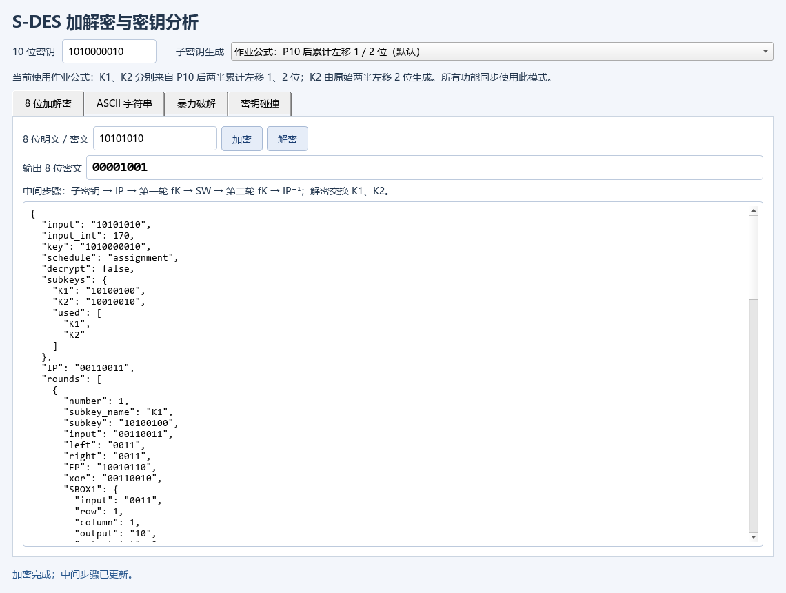
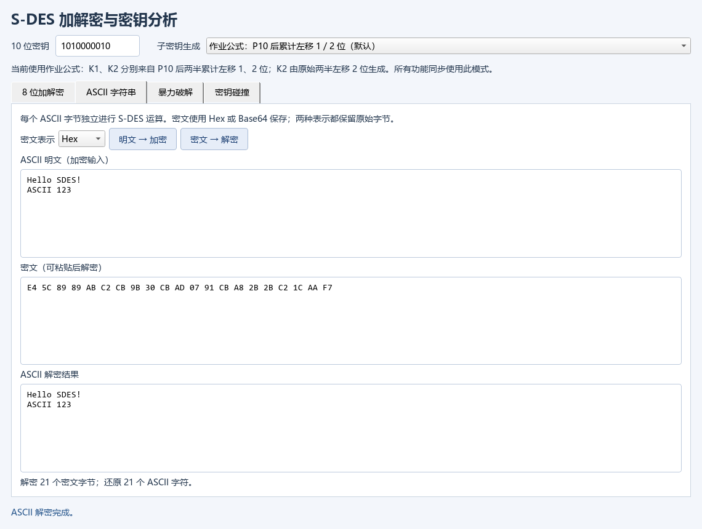
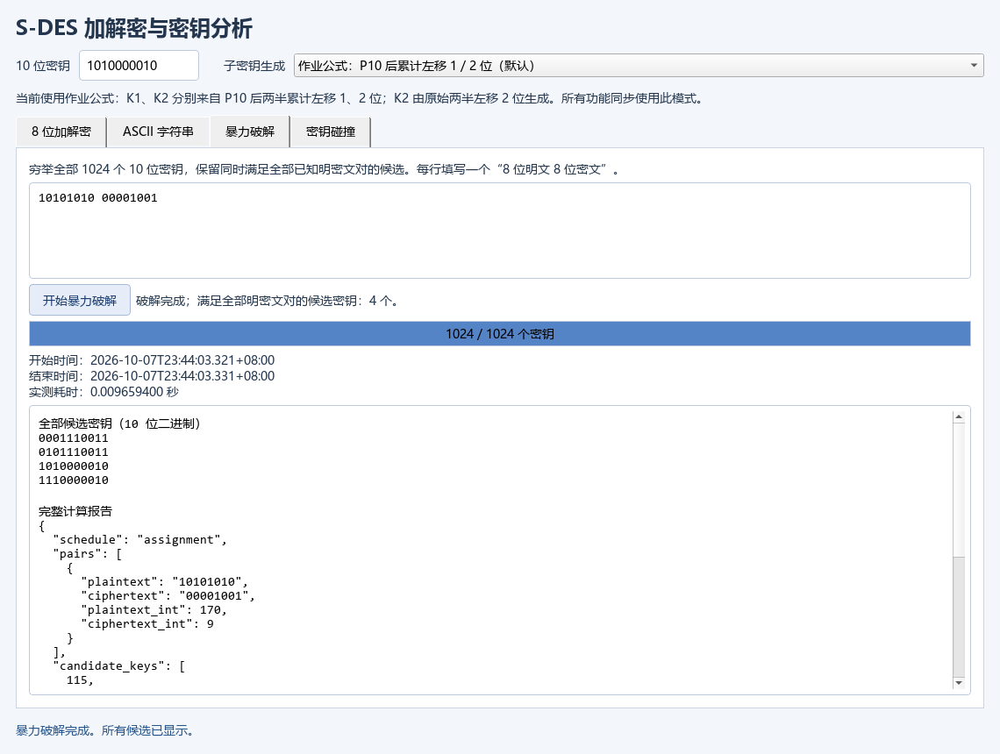
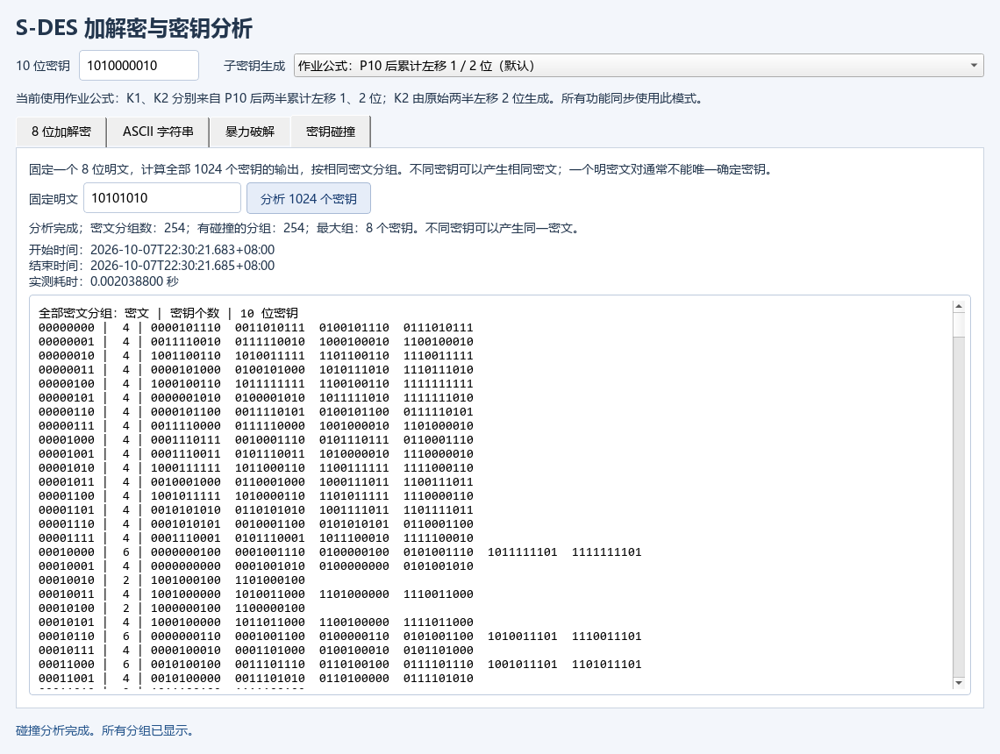

# 实验一 S-DES 操作指南

本项目提供 8 位分组加解密、ASCII 字符串逐字节加解密、已知明密文暴力破解和密钥碰撞分析。以下命令均在 `exp1` 目录执行。算法使用作业给定的置换表与 S 盒；子密钥模式必须在加密、解密和分析之间保持一致。

## 1. 环境准备与启动

需要 Python **3.10 或更高版本**。本次验证环境为 Python **3.13.5**、PyQt5 **5.15.10**、Qt 运行时 **5.15.2**。PyQt5 包版本与 Qt 运行时版本是不同的版本号。

在终端进入 `exp1` 后安装项目依赖并启动 GUI：

```powershell
python -m pip install -r requirements.txt
python gui.py
```

如果希望使用独立虚拟环境，可在安装前执行：

```powershell
python -m venv .venv
.\.venv\Scripts\Activate.ps1
```

若 PowerShell 阻止激活脚本，也可以直接使用虚拟环境中的 Python：

```powershell
.\.venv\Scripts\python.exe -m pip install -r requirements.txt
.\.venv\Scripts\python.exe gui.py
```

核心算法与 CLI 使用 Python 标准库；PyQt5 用于图形界面与截图。检查当前解释器与依赖：

```powershell
python --version
python -m pip show PyQt5
```

## 2. 先确认子密钥生成模式

窗口顶部的“子密钥生成”选择会同步作用于四个标签页。CLI 默认模式也为 `assignment`。

| 模式 | 界面说明 | 从 P10 结果的两半累计左移 | 用途 |
|---|---|---|---|
| `assignment` | 作业公式，默认 | K1 为 1 位，K2 为 2 位 | 按作业公式进行实验 |
| `cumulative` | 课件兼容 | K1 为 1 位，K2 为 3 位 | 兼容先移 1 位、再继续移 2 位的课件流程 |

`assignment` 中 K2 是从 **P10 的原始两半各左移 2 位**后生成；`cumulative` 中 K2 是从生成 K1 时的两半再各左移 2 位后生成。两种模式不会修改置换表或 S 盒。切换 GUI 模式时，旧输出会清除，需要重新运行；已知明密文输入仍需与当前模式相符。

例如，密钥 `1010000010`、明文 `10101010`：

| 模式 | K1 | K2 | 密文 |
|---|---|---|---|
| `assignment` | `10100100` | `10010010` | `00001001` |
| `cumulative` | `10100100` | `01000011` | `10001101` |

下文未特别注明的示例全部使用默认 `assignment` 模式。

## 3. GUI 四个标签页

### 3.1 “8 位加解密”

1. 顶部“10 位密钥”输入 `1010000010`。
2. “8 位明文 / 密文”输入 `10101010`，点击“加密”。输出应为 `00001001`。
3. 将输入改为 `00001001`，点击“解密”。输出应还原为 `10101010`。

位串只能包含 `0`、`1`，密钥必须恰好 **10 位**，分组必须恰好 **8 位**，包括开头的零。例如 `00001001` 不能写成 `1001`。GUI 会去除位串两端空白，但不接受位串中间的空格或其他字符。

下方滚动区域展示真实计算轨迹：K1/K2、IP、两轮输入、E/P 扩展、异或、S 盒行列与输出、P4、SW、最终 IP⁻¹ 等。解密按 K2、K1 的顺序使用子密钥。输入错误会在窗口底部以红色文字显示，不会弹出阻塞对话框。



### 3.2 “ASCII 字符串”

在“ASCII 明文”输入 `Hello SDES!`，选择 `Hex` 后点击“明文 → 加密”，密文为：

```text
E4 5C 89 89 AB C2 CB 9B 30 CB AD
```

点击“密文 → 解密”，下方应显示原文 `Hello SDES!`。GUI 的 Hex 输入也接受不带空格的形式 `E45C8989ABC2CB9B30CBAD`。

若选择 `Base64` 后重新加密，同样的明文与密钥得到：

```text
5FyJiavCy5swy60=
```

Base64 解密时必须选择 `Base64`；Hex 解密时必须选择 `Hex`。更改表示方式后需要重新加密，或粘贴符合新表示方式的密文。GUI 支持 Hex 中的字节间空白和 Base64 输入中的空白，Base64 的有效字符与填充仍必须正确。

ASCII 范围为 0～127。英文字母、数字、常用英文标点及换行可以使用；中文、`é`、表情等非 ASCII 字符会被拒绝。每个明文字节独立加密为一个密文字节，不添加填充。密文字节可能超过 127，因此必须通过 Hex/Base64 表示，不能直接把任意密文字节强行当成 ASCII 文本。



### 3.3 “暴力破解”

这个标签页使用已知明密文对检查全部 1024 个密钥，不依赖窗口顶部填写的某个密钥值。

在输入框中每行填一对“8 位明文 空格 8 位密文”，例如：

```text
10101010 00001001
```

点击“开始暴力破解”，程序显示真实检查进度、全部候选的 10 位位串、开始时间、结束时间与实测耗时。上例有 4 个候选：

```text
0001110011
0101110011
1010000010
1110000010
```

加入第二对再运行：

```text
10101010 00001001
00000000 01101010
```

此时保留两个候选 `1010000010`、`1110000010`。程序会报告全部候选，不能将这两个候选视为已唯一确定原始密钥。零候选说明这些输入对与选定模式不相容，也可能是明文、密文或模式填写错误。

GUI 接受每行用空白、英文逗号或中文逗号分隔的两段位串；建议统一使用空格。GUI 不接受 CLI 示例中的冒号分隔形式。计算由后台线程执行，计算期间所有操作输入、密文格式、按钮及模式选择被禁用，结果与本次输入保持对应。非法输入会撤下旧分析报告和计时；后台任务失败显示失败前实测耗时，结束后可修正并重试。



### 3.4 “密钥碰撞”

在“固定明文”中输入一个 8 位位串，例如 `10101010`，点击“分析 1024 个密钥”。程序用每个可能密钥加密该明文，然后按密文分组；此操作也不依赖顶部填写的单个密钥。

界面显示不同密文分组数、有碰撞的分组数、最大组大小，并按“密文 | 密钥个数 | 10 位密钥”列出全部分组。对于示例明文和默认模式，有 **254** 个非空密文分组，最大组含 **8** 个密钥。完整分组可通过滚动查看。

固定明文时，1024 个密钥只能映射到最多 256 个密文，因此不同密钥产生同一密文的碰撞不可避免。但某个明文上的碰撞并不证明这些密钥对其他明文也相同。



## 4. CLI 命令

GUI 与 CLI 使用同一核心。首先查看实际命令帮助：

```powershell
python cli.py --help
python cli.py bits encrypt --help
python cli.py ascii encode --help
python cli.py attack --help
python cli.py collision --help
```

### 位串加解密与轨迹

```powershell
python cli.py bits encrypt 10101010 --key 1010000010
python cli.py bits decrypt 00001001 --key 1010000010
python cli.py bits encrypt 10101010 --key 1010000010 --trace
python cli.py bits encrypt 10101010 --key 1010000010 --schedule cumulative
```

前两条分别输出 `00001001`、`10101010`；第三条输出含中间步骤的 JSON；第四条输出课件兼容模式密文 `10001101`。命令行位串必须恰好满足位宽，不能在位串参数中加入空白。

### ASCII 的 Hex 与 Base64

```powershell
python cli.py ascii encode 'Hello SDES!' --key 1010000010 --format hex
python cli.py ascii decode E45C8989ABC2CB9B30CBAD --key 1010000010 --format hex
python cli.py ascii encode 'Hello SDES!' --key 1010000010 --format base64
python cli.py ascii decode '5FyJiavCy5swy60=' --key 1010000010 --format base64
```

Hex 加密输出 `E45C8989ABC2CB9B30CBAD`，Base64 加密输出 `5FyJiavCy5swy60=`，两个解密命令都输出 `Hello SDES!`。CLI 的 `--format` 值为小写 `hex` 或 `base64`；省略时为 `hex`。带空格的 Hex 密文须用引号包围；CLI Base64 解码严格校验，不要复制额外的空白。

### 已知明密文破解

```powershell
python cli.py attack --pair 10101010:00001001
python cli.py attack --pair 10101010:00001001 --pair 00000000:01101010
python cli.py attack --pairs-file pairs.txt
```

`--pair` 可以重复。`pairs.txt` 保存为 UTF-8，每行一对，例如：

```text
10101010 00001001
00000000 01101010
```

CLI 的文件与 `--pairs` 输入支持冒号、英文逗号或空白分隔，也支持空行和以 `#` 开头的注释行。还可以通过标准输入读取：

```powershell
Get-Content -LiteralPath pairs.txt -Encoding utf8 | python cli.py attack --stdin
```

输出 JSON 中 `candidate_key_bits` 是全部候选位串，`tested_keys` 是实际检查数，`started_at`、`finished_at` 和 `elapsed_seconds` 是该次真实运行的计时信息。每次耗时会随环境变化。

### 碰撞扫描与等价密钥

```powershell
python cli.py collision --plaintext 10101010
python cli.py collision --all
python cli.py collision --equivalent
python cli.py collision --equivalent --schedule cumulative
```

`--plaintext` 对一个明文分组，`--all` 扫描全部 256 个明文，`--equivalent` 比较每个密钥对全部 256 个明文的完整加密映射。三种选项每次只能选择一种。

在默认 `assignment` 模式下，`1010000010` 与 `1110000010` 对全部 256 个明文产生相同密文，是全局等价密钥。因此即使增加更多合法明密文对，也无法区分这两个密钥。这个等价关系是完整映射比较的结果；仅观察一个明文上的相同密文不足以判定全局等价。切换模式后应重新分析，不能沿用另一模式的等价结论。

## 5. JSON / CSV 交换向量

`scripts/run_evidence.py` 会在 `results/` 生成 `cross_vectors.json` 和 `cross_vectors.csv`，包含两种模式的本地验证向量，可用于交换测试的统一格式。每条向量至少需要：

| 字段 | 含义 |
|---|---|
| `schedule` | `assignment` 或 `cumulative` |
| `key_bits` | 10 位密钥字符串，保留前导零 |
| `plaintext_bits` | 8 位明文字符串 |
| `ciphertext_bits` | 对方给出的 8 位密文字符串 |

JSON 可使用 `{"vectors": [...]}` 或直接使用数组。例如以下是**本地示例数据**：

```json
{
  "vectors": [
    {
      "schedule": "assignment",
      "key_bits": "1010000010",
      "plaintext_bits": "10101010",
      "ciphertext_bits": "00001001"
    }
  ]
}
```

CSV 的最小形式如下，同样是本地示例数据：

```csv
schedule,key_bits,plaintext_bits,ciphertext_bits
assignment,1010000010,10101010,00001001
```

文件采用 UTF-8。不要让电子表格软件把位串转为数字而丢失前导零；上述位串字段都应保留为文本。先查看工具帮助，再比较实际文件：

```powershell
python scripts/compare_cross_vectors.py --help
python scripts/compare_cross_vectors.py results/cross_vectors.json --source-label '本地参考实现生成的向量' --output results/local_vector_comparison.json
python scripts/compare_cross_vectors.py results/cross_vectors.csv --implementation reference --source-label '本地交换格式复验' --output results/local_csv_comparison.json
```

收到其他小组的实际文件后，才可使用对应来源名称。例如已收到 `other_group_vectors.json` 时：

```powershell
python scripts/compare_cross_vectors.py other_group_vectors.json --source-label '实际提供文件的小组编号' --output results/external_vector_comparison.json
```

比较报告保存来源名称、文件路径、SHA-256、验证的向量数及逐行差异，同时验证给定密文能否解回明文。无差异时退出码为0，有差异时为1。非法文件内容退出2，并将输出报告改写为 `successful=false`、`status=invalid_input`，记录 `input_errors`，避免把上次的成功报告当成本次结果；输出路径不能与输入相同。应保存实际收到的文件和来源记录。

项目当前提供的是两个独立**本地实现**的交叉验证与交换工具；没有提供其他小组的实际程序或输出，不能将本地向量比较称为“已经通过他组测试”。JSON/CSV 工具的存在也不代表外部测试已经发生。

## 6. 测试、计算证据与截图复现

运行单元测试：

```powershell
python -m unittest discover -s tests -v
```

测试包括输入约束、已知向量、两个独立本地实现的比较、ASCII/字节往返、破解与碰撞分析、交换文件及 GUI 错误状态回归。两种模式的全域测试各覆盖 1024 个密钥 × 256 个分组。没有安装 PyQt5 时，GUI 回归测试会标记为跳过；完整计算证据生成要求依赖已安装且全部测试通过、无跳过。

生成完整计算证据：

```powershell
python scripts/run_evidence.py
```

结果保存在 `results/`，主要文件包括：

- `unit_tests.txt`、`unit_tests.json`：测试日志与结构化结果。
- `hand_vectors.json`、`cross_vectors.json`、`cross_vectors.csv`：手算及独立本地实现验证向量。
- `ascii_vectors.json`：ASCII 和全部字节范围的往返结果。
- `brute_force_assignment.json`、`brute_force_cumulative.json`：逐步增加明密文对后的全部候选与实测计时。
- `collision_buckets_*.json`、`collision_scan_*.json/.csv`：固定明文分组及全部明文扫描。
- `equivalent_keys_*.json`、`full_mapping_*.bin`：等价密钥与完整加密映射。
- `summary.json`、`evidence_manifest.json`：结果汇总、运行环境与文件摘要。

生成真实 GUI 静态截图与控件检查记录：

```powershell
python scripts/capture_gui.py
```

脚本明确设置 `QT_QPA_PLATFORM=offscreen`，通过 QtTest 操作本应用控件，并使用 `QWidget.grab()` 保存真实窗口；不会控制其他桌面应用。Windows offscreen 插件会显式加载本机中文字体，保证截图可读。

生成后运行 `python scripts/audit_submission.py`，只读核对链接、测试记录、源码与结果/截图摘要；若源码或证据已变动，会提示重新生成。

默认输出到 `artifacts/gui/`：

- `01_bits_encrypt.png`、`02_bits_decrypt.png`：位串加解密。
- `03_ascii_hex.png`、`04_ascii_base64.png`：ASCII 两种密文表示。
- `05_brute_single_pair.png`、`06_brute_multiple_pairs.png`：单对与多对破解。
- `07_collision.png`：密钥碰撞分组。
- `08_invalid_input.png`、`09_invalid_ascii.png`：非法输入提示。
- `10_cumulative_mode.png`：课件兼容模式。
- `capture_manifest.json`：控件检查结果、截图列表和真实任务计时。

当前仅保存静态截图和真实任务计时，动态演示已删除。第 4 关的实现与计算验证通过，但作业要求的视频或动图提交证据未保留。GUI 后台分析的计时见 `capture_manifest.json` 中的任务报告；算法原始计时见结果中的 `elapsed_seconds`。

也可以选择其他输出目录：

```powershell
python scripts/capture_gui.py --output artifacts/gui_repeat
```

## 7. 常见问题

- **找不到 PyQt5：** 用启动程序的同一个解释器执行 `python -m pip install -r requirements.txt`，核对 `python -m pip show PyQt5`。
- **加密后不能还原：** 检查密钥、位宽、子密钥模式和 Hex/Base64 选择是否一致；密文中的前导零不能省略。
- **ASCII 解密报错：** 检查密文格式、密钥和模式。错误密钥解出的字节可能超过 ASCII 范围，程序会拒绝将其强转为 ASCII。
- **破解没有候选：** 核对每一对明密文是否真实对应，并检查它们是否来自当前模式。
- **增加明密文对后仍有多个候选：** 当前证据可能不足，也可能剩余密钥在全部明文上等价。用 `collision --equivalent` 检查完整映射，不能直接宣布唯一恢复密钥。

S-DES 是教学用的小规模密码；本项目逐字节独立加密会暴露重复字节，不适合保护实际敏感信息。
